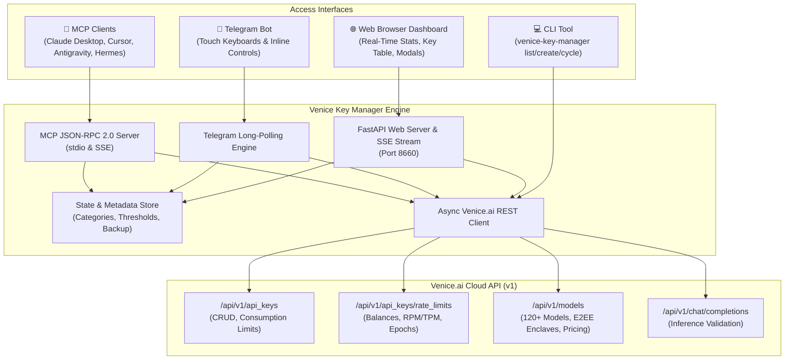

# ⚡ Venice Key Manager

[](LICENSE)
[](https://www.python.org/)
[](https://modelcontextprotocol.io/)
[](https://fastapi.tiangolo.com/)

**Venice Key Manager** is an enterprise-grade control plane, Model Context Protocol (MCP) server, reactive web dashboard, and Telegram bot for managing **Venice.ai** API keys, inference spend ceilings, confidential hardware enclave (E2EE) models, and real-time telemetry.

Built directly against the official Venice.ai REST API specifications, Venice Key Manager provides granular governance over autonomous AI agent fleets, developer teams, and production integrations.

---

## 🚀 Key Features

* **Granular Consumption Limits**: Enforce hard spend ceilings in USD per key with automated reset windows:
  * `EPOCH` (resets daily at 00:00 UTC)
  * `MONTH` (resets monthly on the 1st)
  * `LIFETIME` (permanent spending limit)
* **Daily Key Operations & Spend Reports**: Automated and on-demand telemetry reports aggregating daily spend, 7-day trailing spend, category breakdowns, top spenders, and nearing-ceiling warnings. Deliverable via CLI, Web UI, MCP, or Telegram.
* **Full Model Context Protocol (MCP) Server**: Exposes 10 specialized MCP tools and resources for Cursor, Claude Desktop, Antigravity, and autonomous agent frameworks.
* **Reactive Web Dashboard (Port 8660)**: Dark-mode terminal/obsidian dashboard with real-time KPI metrics, countdown timers, search filters, modal report views, and live Server-Sent Events (SSE).
* **Ubiquitous Copy Buttons**: 1-click clipboard copy buttons wherever a key, ID, masked token, cURL snippet, or JSON payload is displayed.
* **1-Click Key Cycling / Rotation**: Automatically mints a replacement key inheriting identical limits, periods, and categories while cleanly revoking deprecated keys.
* **Low-USD Inference Warning System**:
  * Default alert threshold at **\$0.20 USD**.
  * Configurable global threshold and custom per-key override thresholds.
  * Prominent alert banners, table warning badges, and Telegram alerts.
* **Key Grouping & Categories**: Organize keys into logical categories (`Agents`, `Production`, `Testing`, `Telegram`, `Research`, or custom tags).
* **Downloadable State & Settings Backup**: 1-click JSON backup export and import for disaster recovery and multi-instance synchronization.
* **Full Kitchen-Sink Telegram Touch Bot**: Complete 10-button touch grid with persistent reply keyboard, inline rotation selectors, daily report dispatch, balance warnings, and light inference benchmarks.
* **Inference Playground & Health Probes**: Run instantaneous lightweight completions to measure token count, cost estimation, and API latency.

---

## 🏗️ Architecture



---

## 📦 Quickstart

### Option 1: Local Installation with Python (>= 3.10)

```bash
# 1. Clone repository
git clone https://github.com/maximusmaximus/venice-key-manager.git
cd venice-key-manager

# 2. Install dependencies
pip install -e .

# 3. Configure environment
cp .env.example .env
# Edit .env and insert your VENICE_API_KEY (Admin type required)

# 4. Launch the Web Dashboard
venice-key-manager web --port 8660
```
Open **`http://localhost:8660`** in your browser.

---

### Option 2: Docker / Podman Compose

```bash
docker compose up -d
```
The dashboard will be live at `http://localhost:8660`.

---

## 🔌 Model Context Protocol (MCP) Setup

Venice Key Manager is a compliant Model Context Protocol server. Connect it to your AI coding agents or assistants:

### Claude Desktop & Cursor Integration

Add to your `claude_desktop_config.json` or Cursor MCP settings:

```json
{
  "mcpServers": {
    "venice-key-manager": {
      "command": "python",
      "args": ["-m", "venice_key_manager.mcp_server"],
      "env": {
        "VENICE_API_KEY": "YOUR_VENICE_ADMIN_KEY"
      }
    }
  }
}
```

### Available MCP Tools

| Tool | Description |
| :--- | :--- |
| `venice_list_keys` | Lists all API keys, consumption limits, spend metrics, and warning badges |
| `venice_create_key` | Mints a dedicated key with daily or monthly USD spend ceilings |
| `venice_cycle_key` | Automatically rotates a key, generates replacement, and revokes old key |
| `venice_update_key_limit` | Updates USD spend limit, reset period, or category assignment |
| `venice_revoke_key` | Permanently deletes an API key |
| `venice_get_account_balance` | Queries live USD, DIEM, Credits, and rate limits |
| `venice_list_models` | Queries 120+ models with filters for confidential E2EE enclaves |
| `venice_test_inference` | Runs a latency and health benchmark test |
| `venice_export_backup` | Exports complete JSON backup of categories and settings |
| `venice_daily_report` | Aggregates daily usage, 7d spend, top consumers, and low-balance warnings |

---

## 📱 Telegram Bot Setup

1. Create a bot using [@BotFather](https://t.me/BotFather) and obtain your token.
2. In `.env`:
   ```bash
   TELEGRAM_BOT_TOKEN=123456789:ABCdefGHIjklMNOpqrSTUvwxYZ
   TELEGRAM_ALLOWED_USERS=12345678,87654321  # Optional: Restrict to your Telegram user IDs
   ```
3. Start the bot:
   ```bash
   venice-key-manager bot
   ```
4. In Telegram, interact using the kitchen-sink persistent touch keyboard:
   * `📊 Account & Balance` — Instant account funds & access health check.
   * `🔑 List Keys` — Card overview of keys, current period spend, and limits.
   * `📋 Daily Keys Report` — Real-time telemetry report of spend, categories, and top consumers.
   * `⚠️ Low Balance Alert` — Instant audit of keys approaching exhaustion or low account balance.
   * `➕ Mint Key` — Step-by-step interactive key creation with budget presets ($0.50, $1.00, $2.00, $5.00).
   * `🔄 Cycle Key` — Inline rotation selector to retire old keys and mint replacements.
   * `⚡ Quick Test` — Benchmark latency against Venice `deepseek-v4-flash`.
   * `🔒 E2EE Models` — Catalog of confidential hardware enclave models.
   * `🌐 Web Dashboard` — Quick link to the web control plane.
   * `💾 Download Backup` — Instant JSON backup payload of all categories and settings.

---

## 💻 CLI Command Reference

```bash
# Check account balance and limits
venice-key-manager balance

# Generate daily key usage and spending report
venice-key-manager report
# Dispatch report directly to Telegram
venice-key-manager report --send-tg --chat <chat_id>

# List keys (with category filter or low-balance filter)
venice-key-manager list --category Agents
venice-key-manager list --low-balance

# Mint a new key with $1.00 daily limit
venice-key-manager create --name my-agent --daily-usd 1.00 --period EPOCH --category Agents

# Rotate / cycle a key
venice-key-manager cycle --id <key_id>

# Revoke a key
venice-key-manager revoke --id <key_id>

# Run a test inference
venice-key-manager test --prompt "Hello Venice" --model deepseek-v4-flash

# Export and import backups
venice-key-manager backup export --out my-backup.json
venice-key-manager backup import --file my-backup.json
```

---

## 🔒 Security & Privacy

* **Zero Leaks**: The Master Admin API Key is read exclusively from environment variables and is never transmitted to the browser client or logged in plaintext.
* **One-Time Key Revelation**: When minting or cycling a key, the full API token is returned exactly once in an encrypted session modal.
* **Telegram Authorization**: Enforce strict access control with `TELEGRAM_ALLOWED_USERS`.
* **Zero Hardcoded Identifiers**: Designed for generic, multi-tenant, and open-source deployment.

---

## 📄 License

Licensed under the [MIT License](LICENSE).
