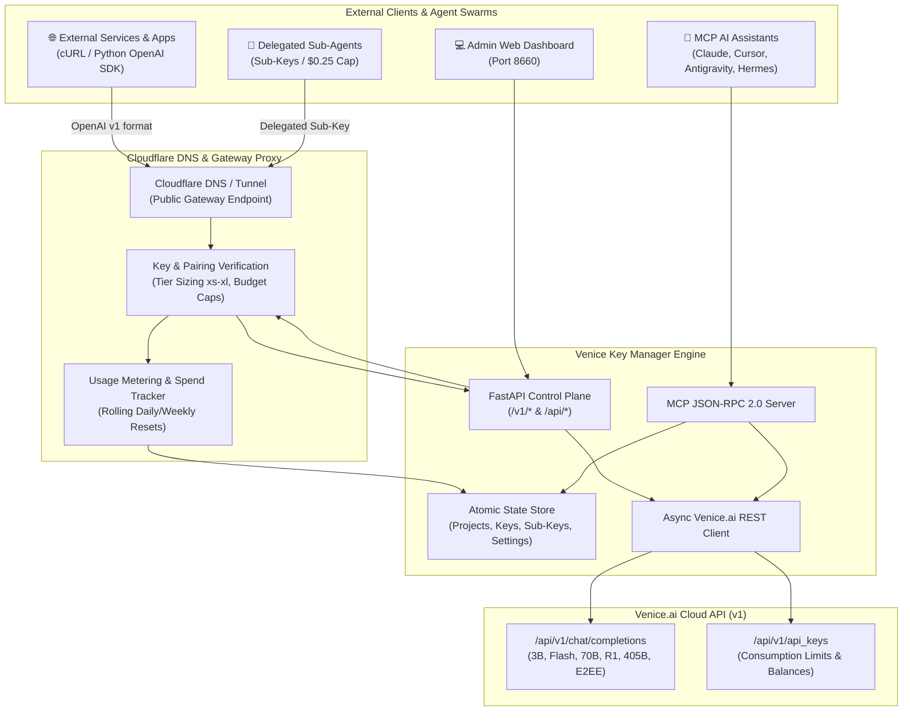
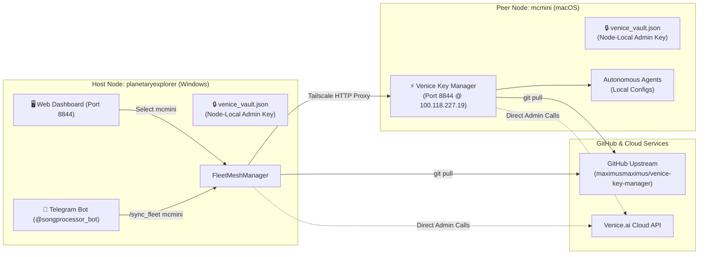

# ⚡ Venice Key Manager

[](LICENSE)
[](https://www.python.org/)
[](https://modelcontextprotocol.io/)
[](https://fastapi.tiangolo.com/)

**Venice Key Manager** is an enterprise-grade control plane, Model Context Protocol (MCP) server, reactive web dashboard, and OpenAI-compatible inference gateway for managing **Venice.ai** API keys, project allocations, confidential hardware enclave (E2EE) models, and keyed gated inference across autonomous AI agent swarms and external client services.

Built directly against the official Venice.ai REST API specifications, Venice Key Manager provides granular governance, real-time telemetry, and delegated sub-key budgets with zero vendor lock-in.

---

## 🚀 Highlights & Capabilities

### 🌐 Keyed Gated Inference via Cloudflare DNS
* **OpenAI-Compatible Gateway**: External services, multi-agent orchestrators, and client applications can target standard OpenAI SDK endpoints (`/v1/chat/completions`, `/v1/models`, `/v1/allocation`) proxied directly to Venice.ai.
* **Cloudflare DNS Integration**: Connect via public Cloudflare tunnels or custom domain DNS with end-to-end TLS. Configure your public gateway endpoint directly from the dashboard.
* **Universal Authentication**: Supports `Authorization: Bearer <token>`, `X-API-Key: <token>`, `X-Pairing-Code: <code>`, and URL query tokens.

### 🧠 Model Tier Sizing Hierarchy (`xs` to `xl`)
Clients can request models by size tier or explicit model identifier:
| Tier | Label & Parameter Class | Default Venice Model | Input / Output (per 1M) | Best Use Cases |
| :---: | :--- | :--- | :---: | :--- |
| **`xs`** | **Extra Small (Ultra Fast / Low Cost)** | `llama-3.2-3b` | \$0.05 / \$0.10 | Heartbeat checks, routing, classification, ultra-low latency tasks |
| **`s`** | **Small (High Speed / Efficient)** | `deepseek-v4-flash` | \$0.15 / \$0.60 | High-throughput agent loops, drafting, summarization |
| **`m`** | **Medium (Balanced Intelligence)** | `llama-3.3-70b` | \$0.40 / \$1.20 | Multi-step tool execution, coding, structured data analysis |
| **`l`** | **Large (Deep Reasoning & Math)** | `deepseek-r1` | \$1.50 / \$4.00 | Complex algorithmic reasoning, STEM problem solving |
| **`xl`** | **Extra Large (Flagship & Enclave)** | `llama-3.1-405b` | \$3.00 / \$8.00 | Frontier 405B capability, confidential hardware enclave (E2EE) models |

* **Strict Tier Enforcement**: Keys configured with a maximum tier ceiling (e.g. `s`) will cleanly reject higher-tier requests (e.g. `m` or `xl`) with descriptive HTTP 403 errors and permitted tier lists.

### 📁 Projects & Dynamic Inference Allocations
* **Project Fleet Management**: Group external services, client teams, or agent swarms into dedicated project pools.
* **Dual Spend Ceilings**: Set daily and weekly budget ceilings in USD per project and per connected key.
* **Rolling Reset Windows**: Automatically resets daily spend at 00:00 UTC and weekly spend on ISO calendar weeks without external cron jobs.
* **On-the-Fly Adjustments**: Admins can increase, decrease, pause, or resume project allocations and agent limits dynamically from the dashboard.

### 🌱 Delegated Sub-Keys ($0.25 Default Cap)
* External users or parent agents can spawn child sub-keys (`/v1/subkeys`) to safely delegate inference to sub-agents or third-party tools.
* **Enforced Default Rule**: **Unless explicitly specified by an admin, all sub-keys default to \$0.25 USD per project per day**.
* Sub-keys automatically inherit the parent project scope, are capped by parent tier restrictions, and cannot exceed parent daily allowances.

### 📊 Reactive Web Dashboard (Port 8660)
* Dark-mode terminal/obsidian UI with real-time KPI metrics, spend progress bars, and countdown timers.
* Dedicated **🌐 External Allocations** tab for project management, external key minting, and cURL / Python code snippets.
* **Ubiquitous Copy Buttons**: 1-click clipboard copy for keys, tokens, IDs, .env files, and cURL snippets.
* **Cryptographic Access Gate**: Web interface is locked behind a pairing token gate and cannot be loaded without an authenticated session.
* **Low-USD Balance Warning System**: Configurable global alert threshold (\$0.20 USD default) and custom per-key override thresholds.

### 🔌 Full Model Context Protocol (MCP) Server
Exposes 20+ specialized tools and resources over stdio / JSON-RPC 2.0 for Claude Desktop, Cursor, Antigravity, and Hermes Agent.

---

## 🏗️ Architecture


```mermaid
flowchart TD
    subgraph Clients["External Clients & Agent Swarms"]
        ExtService["🌐 External Services & Apps\n(cURL / Python OpenAI SDK)"]
        SubAgent["🤖 Delegated Sub-Agents\n(Sub-Keys / $0.25 Cap)"]
        MCPAgents["🔌 MCP AI Assistants\n(Claude, Cursor, Antigravity, Hermes)"]
        Browser["💻 Admin Web Dashboard\n(Port 8660)"]
    end

    subgraph GatewayLayer["Cloudflare DNS & Gateway Proxy"]
        CF["Cloudflare DNS / Tunnel\n(Public Gateway Endpoint)"]
        AuthGate["Key & Pairing Verification\n(Tier Sizing xs-xl, Budget Caps)"]
        Meter["Usage Metering & Spend Tracker\n(Rolling Daily/Weekly Resets)"]
    end

    subgraph Core["Venice Key Manager Engine"]
        FastAPI["FastAPI Control Plane\n(/v1/* & /api/*)"]
        MCPServer["MCP JSON-RPC 2.0 Server"]
        StateStore["Atomic State Store\n(Projects, Keys, Sub-Keys, Settings)"]
        Client["Async Venice.ai REST Client"]
    end

    subgraph VeniceCloud["Venice.ai Cloud API (v1)"]
        VeniceInference["/api/v1/chat/completions\n(3B, Flash, 70B, R1, 405B, E2EE)"]
        VeniceKeys["/api/v1/api_keys\n(Consumption Limits & Balances)"]
    end

    ExtService -->|OpenAI v1 format| CF
    SubAgent -->|Delegated Sub-Key| CF
    CF --> AuthGate
    AuthGate --> FastAPI
    MCPAgents --> MCPServer
    Browser --> FastAPI

    FastAPI --> AuthGate
    AuthGate --> Meter
    Meter --> StateStore
    FastAPI --> Client
    MCPServer --> StateStore
    MCPServer --> Client

    Client --> VeniceInference
    Client --> VeniceKeys
```

---

## 🔌 MCP Server Tools Reference

Venice Key Manager provides comprehensive MCP tool integration:

### Project & Inference Allocation Tools
| MCP Tool | Description | Key Arguments |
| :--- | :--- | :--- |
| `venice_list_projects` | List all project allocation pools with spend, caps, and connected keys. | *(none)* |
| `venice_create_project` | Create a new project allocation for external services or agent swarms. | `name`, `daily_limit_usd`, `max_model_tier`, `default_sub_key_daily_usd` |
| `venice_update_project` | Modify spend ceilings, model tier, or status of an existing project. | `project_id`, `daily_limit_usd`, `max_model_tier`, `status` |

### External Key & Sub-Key Tools
| MCP Tool | Description | Key Arguments |
| :--- | :--- | :--- |
| `venice_list_external_keys` | List external client keys, sub-keys, and parent projects. | `project_id` (optional) |
| `venice_create_external_key` | Generate an external use key tied to a project with tier and daily limit. | `project_id`, `name`, `daily_limit_usd`, `max_model_tier` |
| `venice_create_sub_key` | Delegate a sub-key for an agent (defaults to **\$0.25/day**). | `parent_key_or_token`, `name`, `amount_usd` (default 0.25), `period` |
| `venice_modify_external_key_allocation` | Adjust spend limits, model tier, or active/paused status. | `key_id`, `daily_limit_usd`, `max_model_tier`, `status` |
| `venice_revoke_external_key` | Revoke an external key, immediately blocking inference access. | `key_id_or_token` |

### Gateway & Inference Tools
| MCP Tool | Description | Key Arguments |
| :--- | :--- | :--- |
| `venice_get_gateway_info` | Return Cloudflare gateway URL, tier mapping (`xs`..`xl`), and integration code. | *(none)* |
| `venice_set_cloudflare_gateway_url` | Set or update the public Cloudflare DNS gateway endpoint. | `url` |
| `venice_gateway_chat_completion` | Execute gated inference with tier enforcement (`xs` to `xl`) and live metering. | `auth_token`, `model`, `prompt`, `max_tokens` |

### Core Key Management & Telemetry Tools
| MCP Tool | Description | Key Arguments |
| :--- | :--- | :--- |
| `venice_list_keys` | List native Venice API keys with spend and low-balance alerts. | `category`, `only_low_balance` |
| `venice_create_key` | Mint a native Venice API key with spending caps and reset periods. | `description`, `daily_usd`, `limit_period`, `category` |
| `venice_cycle_key` | Rotate/cycle an existing API key, transferring limits to new key. | `key_id`, `revoke_old`, `new_daily_usd` |
| `venice_update_key_limit` | Update spend limit or category of a Venice key. | `key_id`, `daily_usd`, `limit_period` |
| `venice_revoke_key` | Permanently delete a Venice API key. | `key_id` |
| `venice_get_account_balance` | Fetch real-time USD/DIEM account balances and epoch resets. | *(none)* |
| `venice_list_models` | Query available models with E2EE hardware enclave filter. | `privacy_filter`, `query` |
| `venice_test_inference` | Run a quick lightweight health verification benchmark. | `prompt`, `model`, `api_key` |
| `venice_daily_report` | Generate formatted daily operations report and dispatch to Telegram. | `send_telegram`, `chat_id` |
| `venice_create_batch_codes` | Mint batch of pairing codes with custom prefix. | `prefix`, `count`, `ttl_hours` |
| `venice_create_batch_keys` | Mint batch of Venice API keys with formatted labels. | `prefix`, `count`, `daily_usd` |

---

## 💻 Client Integration Examples

### 1. cURL Gated Inference via Cloudflare DNS

```bash
curl -X POST https://venice-gateway.yourdomain.com/v1/chat/completions \
  -H "Authorization: Bearer vkm_ext_YOUR_KEY" \
  -H "Content-Type: application/json" \
  -d '{
    "model": "xs",
    "messages": [
      {"role": "system", "content": "You are a concise AI assistant."},
      {"role": "user", "content": "Explain zero-data retention in one sentence."}
    ],
    "temperature": 0.3
  }'
```

### 2. Python OpenAI SDK

```python
from openai import OpenAI

# Configure client pointing to your Venice Key Manager Gateway
client = OpenAI(
    base_url="https://venice-gateway.yourdomain.com/v1",
    api_key="vkm_ext_YOUR_KEY",  # Or pairing code token
)

# Use model size tiers: "xs", "s", "m", "l", "xl"
response = client.chat.completions.create(
    model="xs",
    messages=[{"role": "user", "content": "Ping test."}],
    max_tokens=50,
)

print(response.choices[0].message.content)
```

### 3. Check Allocation Status

```bash
curl -s -H "Authorization: Bearer vkm_ext_YOUR_KEY" \
  https://venice-gateway.yourdomain.com/v1/allocation | jq .
```
Response:
```json
{
  "key_name": "Hermes Autonomous Agent",
  "project_id": "proj_swarm_alpha",
  "project_name": "Autonomous Agent Fleet",
  "key_type": "ADMIN_EXTERNAL",
  "daily_limit_usd": 0.50,
  "spent_today_usd": 0.0412,
  "remaining_today_usd": 0.4588,
  "limit_period": "DAY",
  "max_model_tier": "m",
  "status": "active"
}
```

### 4. Delegate Sub-Key (Defaults to $0.25/day)

```bash
curl -X POST https://venice-gateway.yourdomain.com/v1/subkeys \
  -H "Authorization: Bearer vkm_ext_YOUR_KEY" \
  -H "Content-Type: application/json" \
  -d '{
    "name": "Sub-Agent Web Researcher"
  }'
```

---

## ⚙️ Installation & Deployment

### Local / Server Installation

```bash
# 1. Clone repository
git clone https://github.com/maximusmaximus/venice-key-manager.git
cd venice-key-manager

# 2. Install package
pip install -e .

# 3. Configure environment
cp .env.example .env
# Set VENICE_API_KEY=your_venice_admin_key in .env

# 4. Run tests
pytest -v

# 5. Launch web dashboard & gateway
venice-key-manager web --host 0.0.0.0 --port 8660
```

### Systemd Service Setup

```ini
[Unit]
Description=Venice Key Manager Real-Time Dashboard & API Gateway
After=network-online.target
Wants=network-online.target

[Service]
Type=simple
User=molt
WorkingDirectory=/opt/venice-key-manager
ExecStart=/usr/bin/venice-key-manager web --host 0.0.0.0 --port 8660
Restart=always
RestartSec=5

[Install]
WantedBy=multi-user.target
```

Reload and start:
```bash
sudo systemctl daemon-reload
sudo systemctl enable --now venice-key-manager.service
```

---

## 🌐 Multi-Node Fleet Federation & A2A Synchronization

Venice Key Manager natively supports federated multi-machine operation across Tailscale Agent2Agent (A2A) networks (such as primary Windows workstation `planetaryexplorer`, Apple Silicon macOS **`mcmini`**, and remote Linux nodes).


```mermaid
flowchart LR
    subgraph PrimaryNode["Host Node: planetaryexplorer (Windows)"]
        Dashboard["🖥️ Web Dashboard (Port 8844)"]
        TGBot["🤖 Telegram Bot (@songprocessor_bot)"]
        LocalVault["🔒 venice_vault.json\n(Node-Local Admin Key)"]
        LocalMesh["FleetMeshManager"]
    end

    subgraph PeerNode["Peer Node: mcmini (macOS)"]
        McMiniService["⚡ Venice Key Manager\n(Port 8844 @ 100.118.227.19)"]
        McMiniVault["🔒 venice_vault.json\n(Node-Local Admin Key)"]
        McMiniAgents["Autonomous Agents\n(Local Configs)"]
    end

    subgraph Cloud["GitHub & Cloud Services"]
        GitHub["GitHub Upstream\n(maximusmaximus/venice-key-manager)"]
        VeniceAPI["Venice.ai Cloud API"]
    end

    Dashboard -->|Select mcmini| LocalMesh
    TGBot -->|/sync_fleet mcmini| LocalMesh
    LocalMesh -->|Tailscale HTTP Proxy| McMiniService
    LocalMesh -->|git pull| GitHub
    McMiniService -->|git pull| GitHub
    LocalMesh -.->|Direct Admin Calls| VeniceAPI
    McMiniService -.->|Direct Admin Calls| VeniceAPI
    McMiniService --> McMiniAgents
```

### 🔒 Key Architectural Rule: Zero Credential Propagation
* **Node-Local Isolation**: Each machine maintains its own independent `venice_vault.json` containing its node-local Venice Admin Key and agent tokens.
* **Never Synced Over Git**: `venice_vault.json` and `.env` are strictly `.gitignore`'d and are **never** committed or synced across nodes.
* **Mesh Request Proxying**: When Machine A (e.g. Host) configures or triggers a key on Machine B (e.g. `mcmini`), Machine A forwards the request over the encrypted Tailscale mesh (`http://100.118.227.19:8844`). Machine B issues keys locally using its own Admin key and writes to its local agent configs. Admin keys never leave their host machine!

---

### 🚀 Onboarding a New Machine (`mcmini` / macOS / Linux / Windows)

To install or pair an existing/new machine into the Venice Key Management fleet:

#### 1. Clone the Latest Code
```bash
git clone https://github.com/maximusmaximus/venice-key-manager.git
cd venice-key-manager
```

#### 2. Initialize Node-Local Vault
Create or update `venice_vault.json` with that machine's node-local configuration:
```json
{
  "venice": {
    "admin_key": "YOUR_NODE_LOCAL_ADMIN_KEY",
    "inference_key": "YOUR_NODE_LOCAL_INFERENCE_KEY",
    "base_url": "https://api.venice.ai/api/v1"
  },
  "security": {
    "pairing_code": "VK-YOUR-SECRET-CODE",
    "require_pairing": true
  },
  "cloudflare": {
    "domain": "",
    "tunnel_token": ""
  },
  "telegram": {
    "authorized_chat_id": "8293122782"
  },
  "keys": [],
  "subkeys": []
}
```

### 🔒 Dual-Mode Security Gate & Guest Key Validator
Every machine running Venice Key Manager features a dual-mode access security gate:

1. **Unauthenticated / Guest Mode**:
   - Visitors connecting without pairing can use the **Key Ingestion & Sandbox Validator** (`POST /api/validate_key`).
   - The node safely checks the key against Venice.ai's live balances and runs a 15-token inference latency test (`deepseek-v4-flash`).
   - Returns valid status, live USD balance, DIEM token balance, and model tier without exposing the host's vault, agent configs, or mesh nodes.
   - Any attempt to access vault keys, agent bots, or fleet settings returns `HTTP 401 Unauthorized` with `{"requires_pairing": true}`.

2. **Authenticated / Paired Mode**:
   - Node administrators unlock the dashboard by entering their node's secure **Pairing Code** (`VK-XXXXXXXX`).
   - Telegram bot command `/pair_code` displays the current pairing code directly in the authorized Telegram chat.
   - Authenticated sessions can issue keys, mint budget-capped sub-keys ($0.25 default), and auto-deploy to agents (`hermes-music`, `a2a-node`, `dawagent`, `worker-audio`).


#### 3. Start the Service Daemon

**On macOS (`mcmini`) or Linux**:
```bash
# Direct run or inside tmux/screen:
python3 run.py --all

# Or run as a background daemon:
nohup python3 run.py --all > venice_manager.log 2>&1 &
```

**On Windows (`planetaryexplorer`)**:
```powershell
python run.py --all
```

#### 4. Verify Service & Tailscale Pairing
Once running on the new node, verify it responds on the Tailscale network:
```bash
curl http://100.118.227.19:8844/api/version
```
Output:
```json
{
  "success": true,
  "version": "1.2.0",
  "commit": "2c8508b",
  "branch": "main",
  "node_name": "mcmini",
  "os": "darwin"
}
```

#### 5. Pair with Other Fleet Machines
In the Web Dashboard (`http://localhost:8844`):
1. Navigate to the **🌐 A2A Fleet Mesh** tab.
2. Click **➕ Pair New Machine**.
3. Enter Identifier (`mcmini`), Tailscale Base URL (`http://100.118.227.19:8844`), and Display Label (`McMini macOS`).
4. Click **Save & Pair Node**.

---

### 🔄 Fleet Synchronization Workflow (Always Run Latest Code)

Whenever code updates are pushed to GitHub, you can keep all fleet machines running the latest code without SSH-ing into each one:

| Control Method | Action / Command | Description |
| :--- | :--- | :--- |
| **Web Dashboard** | Top-bar **`[ 📥 Pull Git ]`** button | Pulls latest commit on currently selected active machine (`local` or `mcmini`). |
| **Web Dashboard** | **`A2A Fleet Mesh`** tab &rarr; **`[ 🔄 Sync All Nodes ]`** | Broadcasts Git update across all online machines simultaneously. |
| **Telegram Bot** | `/fleet` | Displays live online/offline status, latency, and current Git commit per machine. |
| **Telegram Bot** | `/sync_fleet [node\|all]` | Triggers Git pull on specific node (`/sync_fleet mcmini`) or all nodes (`/sync_fleet all`). |
| **Telegram Bot** | Inline buttons: `[ 📥 Git Pull mcmini ]` | 1-tap update directly in chat. |
| **MCP Tools** | `venice_fleet_sync_node(node="all")` | Automated programmatic Git pull trigger from AI agents. |
| **REST API** | `POST /api/fleet/sync {"node": "mcmini"}` | Webhook or CI/CD deployment trigger. |

---

## 🔒 Security & Privacy Guarantees

* **Zero Plaintext Secrets in Git**: Secret keys, environment files, and credentials are never checked into version control.
* **Node-Local Master Vault**: Master Admin keys never travel across the network.
* **Single-Reveal API Keys**: Native Venice API tokens are displayed once upon minting and never stored in plaintext by the backend.
* **E2EE & ZDR Visibility**: Visual badges and filtering for confidential hardware enclave models (AMD SEV-SNP) and Zero Data Retention models.
* **Granular Spend Defense**: Automated hard-stop limits ensure no autonomous agent or external service can run over allocated daily or weekly USD ceilings.

---

## 📄 License

This project is licensed under the MIT License. See [LICENSE](LICENSE) for details.

