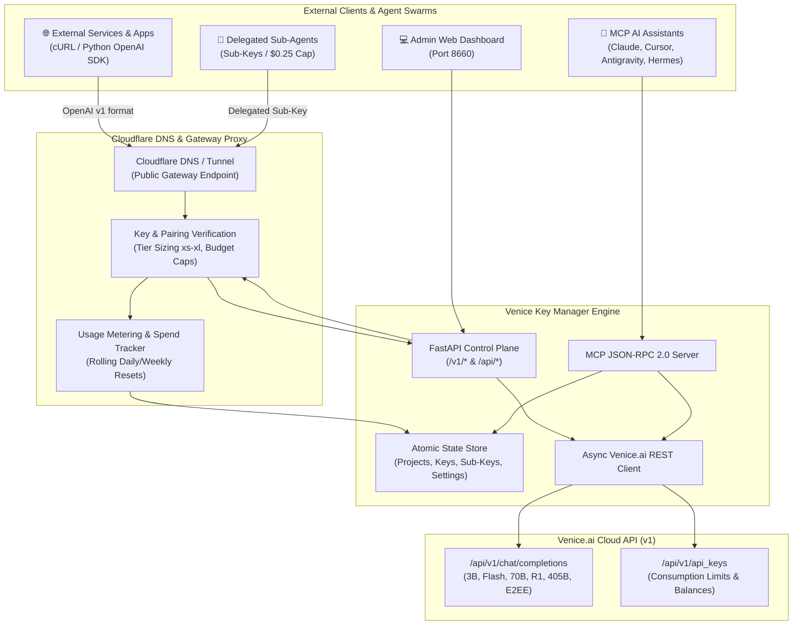
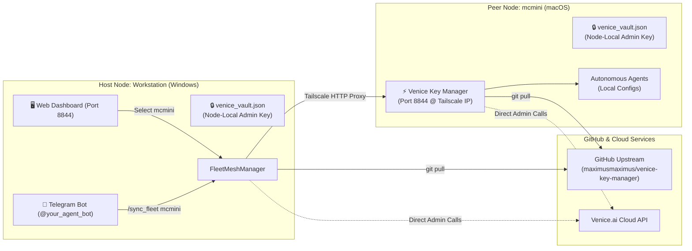
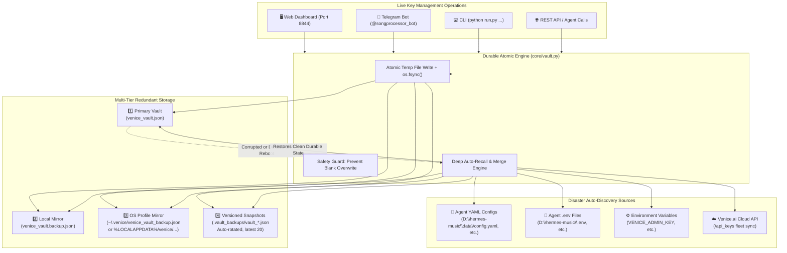
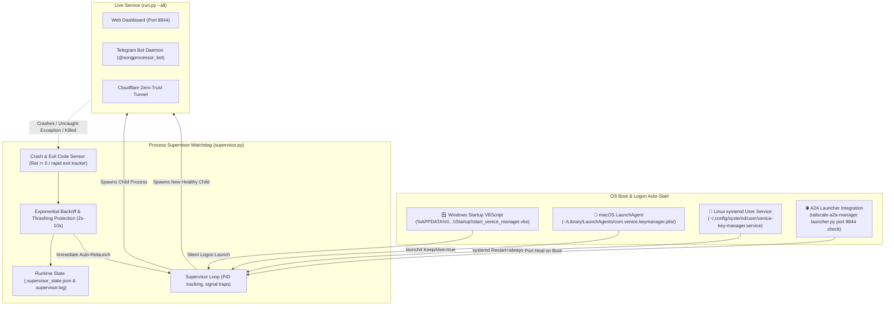

# ⚡ Venice Key Manager

[](LICENSE)
[](https://www.python.org/)
[](https://modelcontextprotocol.io/)
[](https://fastapi.tiangolo.com/)

**Venice Key Manager** is an enterprise-grade control plane, Model Context Protocol (MCP) server, reactive web dashboard, and OpenAI-compatible inference gateway for managing **Venice.ai** API keys, project allocations, confidential hardware enclave (E2EE) models, and keyed gated inference across autonomous AI agent swarms and external client services.

Built directly against the official Venice.ai REST API specifications, Venice Key Manager provides granular governance, real-time telemetry, and delegated sub-key budgets with zero vendor lock-in.

---

## 🚀 Highlights & Capabilities

### 🌐 Keyed Gated Inference via Cloudflare DNS
* **OpenAI-Compatible Gateway**: External services, multi-agent orchestrators, and client applications can target standard OpenAI SDK endpoints (`/v1/chat/completions`, `/v1/models`, `/v1/allocation`) proxied directly to Venice.ai.
* **Cloudflare DNS Integration**: Connect via public Cloudflare tunnels or custom domain DNS with end-to-end TLS. Configure your public gateway endpoint directly from the dashboard.
* **Universal Authentication**: Supports `Authorization: Bearer <token>`, `X-API-Key: <token>`, `X-Pairing-Code: <code>`, and URL query tokens.

### 🧠 Model Tier Sizing Hierarchy (`xs` to `xl`)
Clients can request models by size tier or explicit model identifier:
| Tier | Label & Parameter Class | Default Venice Model | Input / Output (per 1M) | Best Use Cases |
| :---: | :--- | :--- | :---: | :--- |
| **`xs`** | **Extra Small (Ultra Fast / Low Cost)** | `llama-3.2-3b` | \$0.05 / \$0.10 | Heartbeat checks, routing, classification, ultra-low latency tasks |
| **`s`** | **Small (High Speed / Efficient)** | `deepseek-v4-flash` | \$0.15 / \$0.60 | High-throughput agent loops, drafting, summarization |
| **`m`** | **Medium (Balanced Intelligence)** | `llama-3.3-70b` | \$0.40 / \$1.20 | Multi-step tool execution, coding, structured data analysis |
| **`l`** | **Large (Deep Reasoning & Math)** | `deepseek-r1` | \$1.50 / \$4.00 | Complex algorithmic reasoning, STEM problem solving |
| **`xl`** | **Extra Large (Flagship & Enclave)** | `llama-3.1-405b` | \$3.00 / \$8.00 | Frontier 405B capability, confidential hardware enclave (E2EE) models |

* **Strict Tier Enforcement**: Keys configured with a maximum tier ceiling (e.g. `s`) will cleanly reject higher-tier requests (e.g. `m` or `xl`) with descriptive HTTP 403 errors and permitted tier lists.

### 📁 Projects & Dynamic Inference Allocations
* **Project Fleet Management**: Group external services, client teams, or agent swarms into dedicated project pools.
* **Dual Spend Ceilings**: Set daily and weekly budget ceilings in USD per project and per connected key.
* **Rolling Reset Windows**: Automatically resets daily spend at 00:00 UTC and weekly spend on ISO calendar weeks without external cron jobs.
* **On-the-Fly Adjustments**: Admins can increase, decrease, pause, or resume project allocations and agent limits dynamically from the dashboard.

### 🌱 Delegated Sub-Keys ($0.25 Default Cap)
* External users or parent agents can spawn child sub-keys (`/v1/subkeys`) to safely delegate inference to sub-agents or third-party tools.
* **Enforced Default Rule**: **Unless explicitly specified by an admin, all sub-keys default to \$0.25 USD per project per day**.
* Sub-keys automatically inherit the parent project scope, are capped by parent tier restrictions, and cannot exceed parent daily allowances.

### 🎟️ Agent Key Allocations (`https://venice.vmu.cash/claim/...`)
Venice Key Manager provides an automated, secure key distribution protocol for autonomous agents without directly sharing raw secret keys:
* **Cloud DNS Canonical Pattern**: All minted allocation links follow the format `https://venice.vmu.cash/claim/<claim_token>` with a 48-character cryptographically secure token (`vclm_...`).
* **Zero Secret Key Exposure**: The raw Venice API key is stored securely in the local vault and is never exposed in the URL, shared in chat, or returned by public inspection endpoints.
* **Transparent Quota & Schedule Telemetry**:
  - `allocated_keys_count`: Total keys allocated to this claim token (e.g. 1 key, or a pool of N keys).
  - `remaining_claims`: Real-time remaining keys available to claim.
  - `valid_from` & `valid_until`: Cryptographically enforced claiming window. Requests made before `valid_from` return `400 PENDING`, and requests made after `valid_until` return `400 EXPIRED`.
  - `can_claim_now`: Boolean indicating immediate eligibility to claim.
* **Interactive Claim Portal & MCP Tooling**:
  - **Browser Landing Page**: Visiting `/claim/<token>` displays an obsidian-styled card showing agent target, model tier, budget cap, and an interactive **⚡ Claim Allocated Key Now** button.
  - **Model Context Protocol (MCP)**:
    - `venice_mint_allocation`: Mint claim links with custom key counts, validity windows, and quality tiers (`xs` to `xl`).
    - `venice_inspect_allocation`: Publicly inspect quota, status, and dates without revealing secret keys.
    - `venice_claim_allocated_key`: Agents claim their allocated key upon request via MCP, with optional automatic deployment to local `config.yaml`.
    - `venice_list_allocations`: Fleet overview of all active, pending, and claimed allocations.

### 📊 Responsive Web App (served by `python run.py`, default port 8844)
A dependency-free single-page app (`web/app/`, vanilla ES modules, no CDN) that drives **every** tool the
service exposes — the same operations available over Telegram and MCP.

| Route | What it does |
|---|---|
| `#/overview` | Balance health (OK / LOW / OUT), service + bot + tunnel status, allocation counts |
| `#/keys` | Venice keys, validation, deploy to agent configs, delegated sub-keys ($0.25 default cap) |
| `#/allocations` | Mint allocations, copy the `https://venice.vmu.cash/claim/<token>` link, agent instructions + MCP snippet, inspect / revoke / delete |
| `#/playground` | Light inference against any model tier (`xs`–`xl`) |
| `#/agents` | Telegram agent bots, BotFather wizard, test pings |
| `#/fleet` | Multi-node mesh: register nodes (with `remote_pairing_code`), sync, health |
| `#/vault` | Disaster-recovery health, labeled snapshots, restore (backups dir only) |
| `#/settings` | Supervisor restart / boot install, tunnel, pairing code reveal/rotate, LOW/OUT thresholds, config |
| `#/tools` | MCP console — every MCP tool rendered as a schema-driven form |

* **Guest vs paired**: unpaired visitors only see the **key validator** and the pairing form. Everything
  else (and every privileged `/api/*` endpoint) requires the `X-Pairing-Code` header.
* **All viewports**: mobile-first layout, off-canvas drawer below 1024px, tables collapse to cards below
  720px, 44px touch targets, safe-area insets, light/dark themes, `prefers-reduced-motion`, keyboard
  focus styles, `<dialog>`-based forms, live-region toasts.
* **Hardened server**: strict CSP (no inline script), `nosniff`, `X-Frame-Options: DENY`,
  `no-referrer`, 1 MB JSON body limit, path-traversal-safe static serving, secrets redacted from every
  list response (`*_preview` + `has_*` fields only).
* The classic dashboard is still available at **`/legacy/`**.
* New endpoints: `GET /api/health`, `/api/overview`, `/api/balance`, `/api/pairing/code`, `/api/mcp/tools`;
  `POST /api/balance/thresholds`, `/api/pairing/rotate`, `/api/subkeys/remove`, `/api/agent_bots/remove`,
  `/api/mcp/call` (`{name, arguments}`) and `/api/mcp/rpc` (raw MCP JSON-RPC over HTTP).

### 🔌 Full Model Context Protocol (MCP) Server
Exposes 20+ specialized tools and resources over stdio / JSON-RPC 2.0 for Claude Desktop, Cursor, Antigravity, and Hermes Agent.

---

## 🏗️ Architecture


```mermaid
flowchart TD
    subgraph Clients["External Clients & Agent Swarms"]
        ExtService["🌐 External Services & Apps\n(cURL / Python OpenAI SDK)"]
        SubAgent["🤖 Delegated Sub-Agents\n(Sub-Keys / $0.25 Cap)"]
        MCPAgents["🔌 MCP AI Assistants\n(Claude, Cursor, Antigravity, Hermes)"]
        Browser["💻 Admin Web Dashboard\n(Port 8660)"]
    end

    subgraph GatewayLayer["Cloudflare DNS & Gateway Proxy"]
        CF["Cloudflare DNS / Tunnel\n(Public Gateway Endpoint)"]
        AuthGate["Key & Pairing Verification\n(Tier Sizing xs-xl, Budget Caps)"]
        Meter["Usage Metering & Spend Tracker\n(Rolling Daily/Weekly Resets)"]
    end

    subgraph Core["Venice Key Manager Engine"]
        FastAPI["FastAPI Control Plane\n(/v1/* & /api/*)"]
        MCPServer["MCP JSON-RPC 2.0 Server"]
        StateStore["Atomic State Store\n(Projects, Keys, Sub-Keys, Settings)"]
        Client["Async Venice.ai REST Client"]
    end

    subgraph VeniceCloud["Venice.ai Cloud API (v1)"]
        VeniceInference["/api/v1/chat/completions\n(3B, Flash, 70B, R1, 405B, E2EE)"]
        VeniceKeys["/api/v1/api_keys\n(Consumption Limits & Balances)"]
    end

    ExtService -->|OpenAI v1 format| CF
    SubAgent -->|Delegated Sub-Key| CF
    CF --> AuthGate
    AuthGate --> FastAPI
    MCPAgents --> MCPServer
    Browser --> FastAPI

    FastAPI --> AuthGate
    AuthGate --> Meter
    Meter --> StateStore
    FastAPI --> Client
    MCPServer --> StateStore
    MCPServer --> Client

    Client --> VeniceInference
    Client --> VeniceKeys
```

---

## 🔌 MCP Server Tools Reference

Venice Key Manager provides comprehensive MCP tool integration:

### Project & Inference Allocation Tools
| MCP Tool | Description | Key Arguments |
| :--- | :--- | :--- |
| `venice_list_projects` | List all project allocation pools with spend, caps, and connected keys. | *(none)* |
| `venice_create_project` | Create a new project allocation for external services or agent swarms. | `name`, `daily_limit_usd`, `max_model_tier`, `default_sub_key_daily_usd` |
| `venice_update_project` | Modify spend ceilings, model tier, or status of an existing project. | `project_id`, `daily_limit_usd`, `max_model_tier`, `status` |

### External Key & Sub-Key Tools
| MCP Tool | Description | Key Arguments |
| :--- | :--- | :--- |
| `venice_list_external_keys` | List external client keys, sub-keys, and parent projects. | `project_id` (optional) |
| `venice_create_external_key` | Generate an external use key tied to a project with tier and daily limit. | `project_id`, `name`, `daily_limit_usd`, `max_model_tier` |
| `venice_create_sub_key` | Delegate a sub-key for an agent (defaults to **\$0.25/day**). | `parent_key_or_token`, `name`, `amount_usd` (default 0.25), `period` |
| `venice_modify_external_key_allocation` | Adjust spend limits, model tier, or active/paused status. | `key_id`, `daily_limit_usd`, `max_model_tier`, `status` |
| `venice_revoke_external_key` | Revoke an external key, immediately blocking inference access. | `key_id_or_token` |

### Gateway & Inference Tools
| MCP Tool | Description | Key Arguments |
| :--- | :--- | :--- |
| `venice_get_gateway_info` | Return Cloudflare gateway URL, tier mapping (`xs`..`xl`), and integration code. | *(none)* |
| `venice_set_cloudflare_gateway_url` | Set or update the public Cloudflare DNS gateway endpoint. | `url` |
| `venice_gateway_chat_completion` | Execute gated inference with tier enforcement (`xs` to `xl`) and live metering. | `auth_token`, `model`, `prompt`, `max_tokens` |

### Core Key Management & Telemetry Tools
| MCP Tool | Description | Key Arguments |
| :--- | :--- | :--- |
| `venice_list_keys` | List native Venice API keys with spend and low-balance alerts. | `category`, `only_low_balance` |
| `venice_create_key` | Mint a native Venice API key with spending caps and reset periods. | `description`, `daily_usd`, `limit_period`, `category` |
| `venice_cycle_key` | Rotate/cycle an existing API key, transferring limits to new key. | `key_id`, `revoke_old`, `new_daily_usd` |
| `venice_update_key_limit` | Update spend limit or category of a Venice key. | `key_id`, `daily_usd`, `limit_period` |
| `venice_revoke_key` | Permanently delete a Venice API key. | `key_id` |
| `venice_get_account_balance` | Fetch real-time USD/DIEM account balances and epoch resets. | *(none)* |
| `venice_list_models` | Query available models with E2EE hardware enclave filter. | `privacy_filter`, `query` |
| `venice_test_inference` | Run a quick lightweight health verification benchmark. | `prompt`, `model`, `api_key` |
| `venice_daily_report` | Generate formatted daily operations report and dispatch to Telegram. | `send_telegram`, `chat_id` |
| `venice_create_batch_codes` | Mint batch of pairing codes with custom prefix. | `prefix`, `count`, `ttl_hours` |
| `venice_create_batch_keys` | Mint batch of Venice API keys with formatted labels. | `prefix`, `count`, `daily_usd` |

---

## 💻 Client Integration Examples

### 1. cURL Gated Inference via Cloudflare DNS

```bash
curl -X POST https://venice-gateway.yourdomain.com/v1/chat/completions \
  -H "Authorization: Bearer vkm_ext_YOUR_KEY" \
  -H "Content-Type: application/json" \
  -d '{
    "model": "xs",
    "messages": [
      {"role": "system", "content": "You are a concise AI assistant."},
      {"role": "user", "content": "Explain zero-data retention in one sentence."}
    ],
    "temperature": 0.3
  }'
```

### 2. Python OpenAI SDK

```python
from openai import OpenAI

# Configure client pointing to your Venice Key Manager Gateway
client = OpenAI(
    base_url="https://venice-gateway.yourdomain.com/v1",
    api_key="vkm_ext_YOUR_KEY",  # Or pairing code token
)

# Use model size tiers: "xs", "s", "m", "l", "xl"
response = client.chat.completions.create(
    model="xs",
    messages=[{"role": "user", "content": "Ping test."}],
    max_tokens=50,
)

print(response.choices[0].message.content)
```

### 3. Check Allocation Status

```bash
curl -s -H "Authorization: Bearer vkm_ext_YOUR_KEY" \
  https://venice-gateway.yourdomain.com/v1/allocation | jq .
```
Response:
```json
{
  "key_name": "Hermes Autonomous Agent",
  "project_id": "proj_swarm_alpha",
  "project_name": "Autonomous Agent Fleet",
  "key_type": "ADMIN_EXTERNAL",
  "daily_limit_usd": 0.50,
  "spent_today_usd": 0.0412,
  "remaining_today_usd": 0.4588,
  "limit_period": "DAY",
  "max_model_tier": "m",
  "status": "active"
}
```

### 4. Delegate Sub-Key (Defaults to $0.25/day)

```bash
curl -X POST https://venice-gateway.yourdomain.com/v1/subkeys \
  -H "Authorization: Bearer vkm_ext_YOUR_KEY" \
  -H "Content-Type: application/json" \
  -d '{
    "name": "Sub-Agent Web Researcher"
  }'
```

---

## ⚙️ Installation & Deployment

### Local / Server Installation

```bash
# 1. Clone repository
git clone https://github.com/maximusmaximus/venice-key-manager.git
cd venice-key-manager

# 2. Install package
pip install -e .

# 3. Configure environment
cp .env.example .env
# Set VENICE_API_KEY=your_venice_admin_key in .env

# 4. Run tests (sandboxed — never touches the live vault, configs or services)
python -m pytest tests -q

# 5. Launch web app + Telegram bot (+ supervisor-managed restarts: python supervisor.py --run)
python run.py
```

### 🧪 Test Suite

* `tests/__init__.py` copies the vault into a temp sandbox and points `VENICE_VAULT_PATH`,
  `VENICE_SUPERVISOR_STATE_DIR` and agent config deploy targets at temp files, so the suite can run
  safely next to a live service. Set `VENICE_TESTS_USE_LIVE=1` to opt out of the sandbox.
* Tests that hit real external APIs (Telegram `getMe` / ping, Venice balance / inference) are skipped
  unless `VENICE_LIVE_TESTS=1`. The full live end-to-end flow requires `VENICE_E2E_LIVE=1`.
* Legacy FastAPI-gateway tests skip automatically when their optional dependencies are not installed.
* `tests/test_webapp.py` covers the web app: guest gating, redaction, MCP-over-HTTP, path traversal,
  security headers, restore sandboxing, and Telegram command dispatch.

### Systemd Service Setup

```ini
[Unit]
Description=Venice Key Manager Real-Time Dashboard & API Gateway
After=network-online.target
Wants=network-online.target

[Service]
Type=simple
User=molt
WorkingDirectory=/opt/venice-key-manager
ExecStart=/usr/bin/venice-key-manager web --host 0.0.0.0 --port 8660
Restart=always
RestartSec=5

[Install]
WantedBy=multi-user.target
```

Reload and start:
```bash
sudo systemctl daemon-reload
sudo systemctl enable --now venice-key-manager.service
```

---

## 🌐 Multi-Node Fleet Federation & A2A Synchronization

Venice Key Manager natively supports federated multi-machine operation across Tailscale Agent2Agent (A2A) networks (such as primary Windows workstation, Apple Silicon macOS **`mcmini`**, and remote Linux nodes).


```mermaid
flowchart LR
    subgraph PrimaryNode["Host Node: Workstation (Windows)"]
        Dashboard["🖥️ Web Dashboard (Port 8844)"]
        TGBot["🤖 Telegram Bot (@your_agent_bot)"]
        LocalVault["🔒 venice_vault.json\n(Node-Local Admin Key)"]
        LocalMesh["FleetMeshManager"]
    end

    subgraph PeerNode["Peer Node: mcmini (macOS)"]
        McMiniService["⚡ Venice Key Manager\n(Port 8844 @ Tailscale IP)"]
        McMiniVault["🔒 venice_vault.json\n(Node-Local Admin Key)"]
        McMiniAgents["Autonomous Agents\n(Local Configs)"]
    end

    subgraph Cloud["GitHub & Cloud Services"]
        GitHub["GitHub Upstream\n(maximusmaximus/venice-key-manager)"]
        VeniceAPI["Venice.ai Cloud API"]
    end

    Dashboard -->|Select mcmini| LocalMesh
    TGBot -->|/sync_fleet mcmini| LocalMesh
    LocalMesh -->|Tailscale HTTP Proxy| McMiniService
    LocalMesh -->|git pull| GitHub
    McMiniService -->|git pull| GitHub
    LocalMesh -.->|Direct Admin Calls| VeniceAPI
    McMiniService -.->|Direct Admin Calls| VeniceAPI
    McMiniService --> McMiniAgents
```

### 🔒 Key Architectural Rule: Zero Credential Propagation
* **Node-Local Isolation**: Each machine maintains its own independent `venice_vault.json` containing its node-local Venice Admin Key and agent tokens.
* **Never Synced Over Git**: `venice_vault.json` and `.env` are strictly `.gitignore`'d and are **never** committed or synced across nodes.
* **Mesh Request Proxying**: When Machine A (e.g. Host) configures or triggers a key on Machine B (e.g. `mcmini`), Machine A forwards the request over the encrypted Tailscale mesh (`http://<peer-tailscale-ip>:8844`). Machine B issues keys locally using its own Admin key and writes to its local agent configs. Admin keys never leave their host machine!

---

### 🚀 Onboarding a New Machine (`mcmini` / macOS / Linux / Windows)

To install or pair an existing/new machine into the Venice Key Management fleet:

#### 1. Clone the Latest Code
```bash
git clone https://github.com/maximusmaximus/venice-key-manager.git
cd venice-key-manager
```

#### 2. Initialize Node-Local Vault
Create or update `venice_vault.json` with that machine's node-local configuration:
```json
{
  "venice": {
    "admin_key": "YOUR_NODE_LOCAL_ADMIN_KEY",
    "inference_key": "YOUR_NODE_LOCAL_INFERENCE_KEY",
    "base_url": "https://api.venice.ai/api/v1"
  },
  "security": {
    "pairing_code": "VK-YOUR-SECRET-CODE",
    "require_pairing": true
  },
  "cloudflare": {
    "domain": "",
    "tunnel_token": ""
  },
  "telegram": {
    "authorized_chat_id": "<your-telegram-chat-id>"
  },
  "keys": [],
  "subkeys": []
}
```

### 🔒 Dual-Mode Security Gate & Guest Key Validator
Every machine running Venice Key Manager features a dual-mode access security gate:

1. **Unauthenticated / Guest Mode**:
   - Visitors connecting without pairing can use the **Key Ingestion & Sandbox Validator** (`POST /api/validate_key`).
   - The node safely checks the key against Venice.ai's live balances and runs a 15-token inference latency test (`deepseek-v4-flash`).
   - Returns valid status, live USD balance, DIEM token balance, and model tier without exposing the host's vault, agent configs, or mesh nodes.
   - Any attempt to access vault keys, agent bots, or fleet settings returns `HTTP 401 Unauthorized` with `{"requires_pairing": true}`.

2. **Authenticated / Paired Mode**:
   - Node administrators unlock the dashboard by entering their node's secure **Pairing Code** (`VK-XXXXXXXX`).
   - Telegram bot command `/pair_code` displays the current pairing code directly in the authorized Telegram chat.
   - Authenticated sessions can issue keys, mint budget-capped sub-keys ($0.25 default), and auto-deploy to agents (`hermes-music`, `a2a-node`, `dawagent`, `worker-audio`).


#### 3. Start the Service Daemon

**On macOS (`mcmini`) or Linux**:
```bash
# Direct run or inside tmux/screen:
python3 run.py --all

# Or run as a background daemon:
nohup python3 run.py --all > venice_manager.log 2>&1 &
```

**On Windows (Host Workstation)**:
```powershell
python run.py --all
```

#### 4. Verify Service & Tailscale Pairing
Once running on the new node, verify it responds on the Tailscale network:
```bash
curl http://<peer-tailscale-ip>:8844/api/version
```
Output:
```json
{
  "success": true,
  "version": "1.2.0",
  "commit": "2c8508b",
  "branch": "main",
  "node_name": "mcmini",
  "os": "darwin"
}
```

#### 5. Pair with Other Fleet Machines
In the Web Dashboard (`http://localhost:8844`):
1. Navigate to the **🌐 A2A Fleet Mesh** tab.
2. Click **➕ Pair New Machine**.
3. Enter Identifier (`mcmini`), Tailscale Base URL (`http://<peer-tailscale-ip>:8844`), and Display Label (`McMini macOS`).
4. Click **Save & Pair Node**.

---

### 🔄 Fleet Synchronization Workflow (Always Run Latest Code)

Whenever code updates are pushed to GitHub, you can keep all fleet machines running the latest code without SSH-ing into each one:

| Control Method | Action / Command | Description |
| :--- | :--- | :--- |
| **Web Dashboard** | Top-bar **`[ 📥 Pull Git ]`** button | Pulls latest commit on currently selected active machine (`local` or `mcmini`). |
| **Web Dashboard** | **`A2A Fleet Mesh`** tab &rarr; **`[ 🔄 Sync All Nodes ]`** | Broadcasts Git update across all online machines simultaneously. |
| **Telegram Bot** | `/fleet` | Displays live online/offline status, latency, and current Git commit per machine. |
| **Telegram Bot** | `/sync_fleet [node\|all]` | Triggers Git pull on specific node (`/sync_fleet mcmini`) or all nodes (`/sync_fleet all`). |
| **Telegram Bot** | Inline buttons: `[ 📥 Git Pull mcmini ]` | 1-tap update directly in chat. |
| **MCP Tools** | `venice_fleet_sync_node(node="all")` | Automated programmatic Git pull trigger from AI agents. |
| **REST API** | `POST /api/fleet/sync {"node": "mcmini"}` | Webhook or CI/CD deployment trigger. |

---

## 🛡️ Multi-Store Vault Backup, Crash Resilience & Disaster Recovery

Venice Key Manager features an enterprise-grade automated multi-store persistence and crash-resilient disaster recovery architecture. This ensures that sudden machine reboots, unexpected service restarts, power outages, and OS updates never corrupt or wipe your Venice Admin Keys, Inference Keys, Telegram bot tokens, or agent sub-keys.


```mermaid
flowchart TD
    subgraph ActiveOperations["Live Key Management Operations"]
        UI["🖥️ Web Dashboard (Port 8844)"]
        TG["🤖 Telegram Bot (@songprocessor_bot)"]
        CLI["💻 CLI (python run.py ...)"]
        REST["🌐 REST API / Agent Calls"]
    end

    subgraph AtomicStore["Durable Atomic Engine (core/vault.py)"]
        Fsync["Atomic Temp File Write + os.fsync()"]
        Guard["Safety Guard: Prevent Blank Overwrite"]
        AutoRecall["Deep Auto-Recall & Merge Engine"]
    end

    subgraph PersistenceTiers["Multi-Tier Redundant Storage"]
        Primary["1️⃣ Primary Vault\n(venice_vault.json)"]
        LocalMirror["2️⃣ Local Mirror\n(venice_vault.backup.json)"]
        ProfileMirror["3️⃣ OS Profile Mirror\n(~/.venice/venice_vault_backup.json\nor %LOCALAPPDATA%/venice/...)"]
        Snapshots["4️⃣ Versioned Snapshots\n(.vault_backups/vault_*.json\nAuto-rotated, latest 20)"]
    end

    subgraph DiscoverySources["Disaster Auto-Discovery Sources"]
        AgentYAML["📄 Agent YAML Configs\n(D:\\hermes-music\\data\\config.yaml, etc.)"]
        EnvFiles["🔐 Agent .env Files\n(D:\\hermes-music\\.env, etc.)"]
        SystemEnv["⚙️ Environment Variables\n(VENICE_ADMIN_KEY, etc.)"]
        VeniceCloud["☁️ Venice.ai Cloud API\n(/api_keys fleet sync)"]
    end

    UI --> AtomicStore
    TG --> AtomicStore
    CLI --> AtomicStore
    REST --> AtomicStore

    AtomicStore --> Fsync
    Fsync --> Primary
    Fsync --> LocalMirror
    Fsync --> ProfileMirror
    Fsync --> Snapshots

    Primary -.->|Corrupted or Deleted on Reboot| AutoRecall
    AutoRecall --> LocalMirror
    AutoRecall --> ProfileMirror
    AutoRecall --> Snapshots
    AutoRecall --> AgentYAML
    AutoRecall --> EnvFiles
    AutoRecall --> SystemEnv
    AutoRecall --> VeniceCloud
    AutoRecall -->|Restores Clean Durable State| Primary
```

### 1. Multi-Tier Redundant Storage Tiers
* **Primary Store (`venice_vault.json`)**: Live vault queried by dashboard, Telegram bot, and MCP server. Written atomically using temporary files and hardware `os.fsync()` flushing before replacement.
* **Secondary Mirror (`venice_vault.backup.json`)**: Exact synchronized mirror maintained in real-time on every save.
* **User-Profile Mirror (`~/.venice/venice_vault_backup.json` / `%LOCALAPPDATA%\venice\`)**: Stored in user application data outside the repository directory. Survives branch switches, scratch cleanup scripts, and repository re-clones.
* **Rolling Snapshots (`.vault_backups/vault_YYYYMMDD_HHMMSS.json`)**: Timestamped versioned snapshots created on configuration changes. Automatically rotated to retain the 20 most recent snapshots.

### 2. Intelligent Auto-Recall on Startup
If the host computer restarts unexpectedly, or if the primary vault file is ever corrupted, missing, or has empty key fields:
1. `KeyVault` automatically inspects the backup mirrors and restores the latest valid snapshot.
2. If corrupted data was found, the damaged file is preserved in `.vault_backups/corrupt_*` for forensic analysis.
3. The engine automatically scans canonical agent YAML files (`config.yaml`), agent `.env` files, and system environment variables (`VENICE_ADMIN_KEY`, `VENICE_INFERENCE_KEY`, `TELEGRAM_BOT_TOKEN`) to recall any missing credentials.
4. If an Admin Key is configured or recovered, `KeyVault` automatically contacts the Venice API (`/api_keys`) to sync and repopulate the complete catalog of issued keys.
5. The **Safety Guard** actively blocks empty templates from overwriting existing keys unless explicitly forced.

### 3. CLI Management Commands
Manage backups, trigger recall, and inspect disaster recovery status directly via the unified CLI:
```bash
# Check disaster recovery health, mirrors, and snapshot counts
python run.py vault status

# Create an instant labeled backup snapshot across all stores
python run.py vault backup "pre_upgrade"

# Perform a deep auto-recall and sync across mirrors, configs, and Venice API
python run.py vault recall

# List all available backup snapshots with metadata
python run.py vault list

# Restore vault from a specific snapshot file
python run.py vault restore ".vault_backups/vault_20260930_020800_manual_check.json"
```

### 4. Interactive Telegram Bot Commands
* `/backup_vault` or `/backup`: Creates an instant snapshot and confirms sync status to the authorized chat.
* `/recall_vault` or `/recall`: Triggers deep auto-recall and reports recovered keys.
* `/vault_status`: Displays primary vault size, mirror statuses, snapshot count, and active key health.
* **Interactive Dashboard Buttons**: Tap `[ 💾 Backup Vault ]` and `[ 🔄 Recall Keys ]` in the `/menu` dashboard.

### 5. Web Dashboard Disaster Recovery Panel
* Navigate to **⚙️ Vault & Settings** &rarr; **🛡️ Multi-Store Vault Backup & Disaster Recovery**.
* View real-time status badges for Primary Vault, Local Backup Mirror, and User Profile Mirror.
* 1-click **Create Instant Backup**, **Auto-Recall & Recover Keys**, and **View Snapshots** modal with 1-click snapshot restoration.

---

## 🔄 24/7 Auto-Restart, Crash Resilience & OS Boot Daemons

Venice Key Manager features an enterprise-grade multi-tier process supervisor and cross-platform boot daemon architecture guaranteeing continuous 24/7 uptime across system reboots, user logons, and unexpected process crashes.


```mermaid
flowchart TD
    subgraph BootDaemons["OS Boot & Logon Auto-Start"]
        WinBoot["🪟 Windows Startup VBScript\n(%APPDATA%\\...\\Startup\\start_venice_manager.vbs)"]
        MacBoot["🍎 macOS LaunchAgent\n(~/Library/LaunchAgents/com.venice.keymanager.plist)"]
        LinuxBoot["🐧 Linux systemd User Service\n(~/.config/systemd/user/venice-key-manager.service)"]
        A2ALauncher["🌐 A2A Launcher Integration\n(tailscale-a2a-manager launcher.py port 8844 check)"]
    end

    subgraph Watchdog["Process Supervisor Watchdog (supervisor.py)"]
        Supervisor["Supervisor Loop (PID tracking, signal traps)"]
        CrashDetect["Crash & Exit Code Sensor (Ret != 0 / rapid exit tracker)"]
        Backoff["Exponential Backoff & Thrashing Protection (2s-10s)"]
        StateLog["Runtime State (.supervisor_state.json & .supervisor.log)"]
    end

    subgraph Service["Live Service (run.py --all)"]
        WebDash["Web Dashboard (Port 8844)"]
        TgBot["Telegram Bot Daemon (@songprocessor_bot)"]
        CFTunnel["Cloudflare Zero-Trust Tunnel"]
    end

    WinBoot -->|Silent Logon Launch| Supervisor
    MacBoot -->|launchd KeepAlive=true| Supervisor
    LinuxBoot -->|systemd Restart=always| Supervisor
    A2ALauncher -->|Port Heal on Boot| Supervisor

    Supervisor -->|Spawns Child Process| Service
    Service -.->|Crashes / Uncaught Exception / Killed| CrashDetect
    CrashDetect --> Backoff
    Backoff --> StateLog
    Backoff -->|Immediate Auto-Relaunch| Supervisor
    Supervisor -->|Spawns New Healthy Child| Service
```

### 1. Process Supervisor Watchdog (`supervisor.py`)
* **Zero External Dependencies**: Operates with pure standard library Python, enabling execution in any environment.
* **Instant Auto-Restart**: If the service process crashes, runs out of memory, or exits unexpectedly, the supervisor logs the exit code and relaunches it automatically in 2 seconds.
* **Rapid-Crash Backoff Defense**: If the process crashes repeatedly in under 3 seconds, the supervisor dynamically backs off up to 10 seconds to protect CPU resources.
* **Live Telemetry & State Tracking**: Uptime, child process PID, restart counts, and crash history are persisted atomically in `.supervisor_state.json`.
* **Zero-Downtime Remote IPC**: Supports graceful process recycling on-demand via the `.restart_requested` sentinel file, REST API (`POST /api/service/restart`), or Telegram (`/restart_service`).
* **Single Instance Guarantee**: An OS file lock (`.supervisor.lock`) ensures only one supervisor ever runs, even when several auto-start triggers fire at once. A launch also exits if the port is already being served, so it never starts a duplicate service.

### 2. Cross-Platform 1-Click Boot Installation
Auto-start on boot is supported across all major operating systems out of the box:

#### 🪟 Windows Workstation
Everything runs hidden, with no CMD window that could be closed by accident:
* **Startup VBScript** (`%APPDATA%\...\Startup\start_venice_manager.vbs`) starts the supervisor at logon.
* **`VeniceKeyManagerWatchdog` scheduled task** re-launches the supervisor every 5 minutes if it has stopped for any reason. It is allowed to run on battery, has no time limit, and needs no admin rights.
* **`VeniceKeyManagerSupervisor` logon task** is optional. It needs an elevated shell, and the two items above already cover logon without it.
```powershell
# 1-Click PowerShell Installer
powershell -ExecutionPolicy Bypass -File scripts\install_auto_restart.ps1

# Or via CLI (run from an elevated shell to also register the logon task)
python supervisor.py --install
python supervisor.py --status     # shows active methods: windows_startup_vbs, windows_watchdog_task
```

#### 🍎 macOS (Apple Silicon `mcmini`)
Configures a native macOS `LaunchAgent` plist (`~/Library/LaunchAgents/com.venice.keymanager.plist`) using Apple's in-kernel `launchd` supervisor with `<key>KeepAlive</key><true/>` and `<key>RunAtLoad</key><true/>`:
```bash
# 1-Click Bash Installer
bash scripts/install_auto_restart.sh

# Or via CLI
python run.py service install
```

#### 🐧 Linux Nodes
Installs and enables a systemd user or system unit (`~/.config/systemd/user/venice-key-manager.service`) with `Restart=always` and `RestartSec=3`:
```bash
# 1-Click Bash Installer
bash scripts/install_auto_restart.sh
```

### 3. Unified CLI Commands
Inspect, control, and install the service directly from `run.py` or `supervisor.py`:
```bash
# Check supervisor status, uptime, child PID, and boot auto-start methods
python run.py service status

# Install OS boot auto-start daemon for the current machine
python run.py service install

# Remove OS boot auto-start daemon
python run.py service uninstall

# Request an immediate graceful restart of the supervised service
python run.py service restart

# Run the supervisor watchdog in foreground mode
python run.py service supervisor
```

### 4. Interactive Telegram Bot Controls
* `/service_status` or `/status`: Displays supervisor status, port listening state, PID, uptime, restart counts, and active boot methods.
* `/restart_service`: Remotely signals the supervisor to recycle and restart the service within 2 seconds.
* **Dashboard Button**: Tap `[ 🛡️ Auto-Restart & Daemon ]` on the interactive `/menu` dashboard to view real-time health and trigger remote restarts.

### 5. Web Dashboard Resilience Panel
* Navigate to **⚙️ Vault & Settings** &rarr; **🚀 Process Supervisor & 24/7 Auto-Restart Watchdog**.
* View real-time status badges for **Watchdog Status**, **Boot Auto-Start**, **Process Uptime**, and **Total Auto-Restarts**.
* 1-click **Re-install Boot Service** and **Recycle / Restart Service** buttons.

---

## 🔒 Security & Privacy Guarantees

* **Zero Plaintext Secrets in Git**: Secret keys, environment files, and credentials are never checked into version control.
* **Node-Local Master Vault**: Master Admin keys never travel across the network.
* **Single-Reveal API Keys**: Native Venice API tokens are displayed once upon minting and never stored in plaintext by the backend.
* **E2EE & ZDR Visibility**: Visual badges and filtering for confidential hardware enclave models (AMD SEV-SNP) and Zero Data Retention models.
* **Granular Spend Defense**: Automated hard-stop limits ensure no autonomous agent or external service can run over allocated daily or weekly USD ceilings.

---

## 📄 License

This project is licensed under the MIT License. See [LICENSE](LICENSE) for details.

